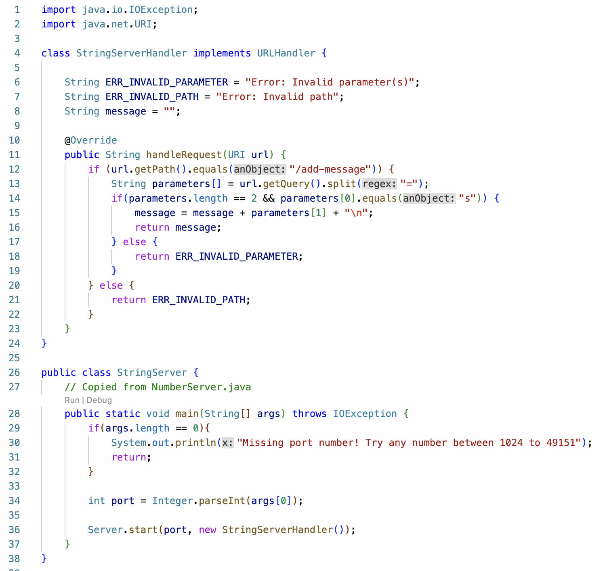
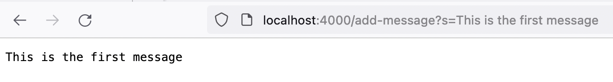
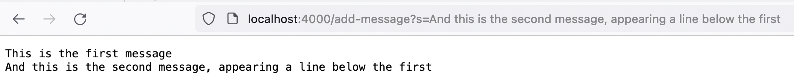
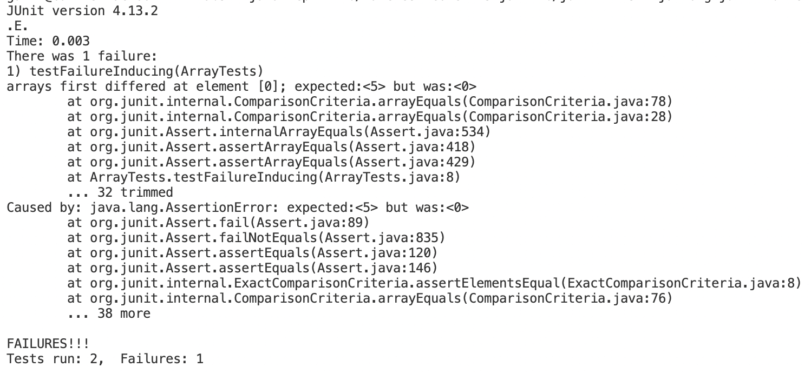

# Lab Report 2: Servers and Bugs

## Part 1

This is the code I used to implement the server:


This is my first screenshot of the server running:


Here, `StringServerHandler`'s `handleRequest` method is called. Its only relevant argument is the URL
`https://localhost:4000/add-message?s=This is the first message`, since it uses the URL to determine
what it needs to add to the meesage, and its only relevant field is `message`, since it uses it in order 
to keep track of what the output should be. `StringServerHandler` also changes `message` by appending to
it the message passed to the function through the URL `"This is the first message"`, followed by a new
line.

This is my second screenshot of the server running:


Once again, `StringServerHandler`'s `handleRequest` method is called. Its only relevant argument is
the URL `https://localhost:4000/add-message?s=And this is the second message, appearing a line below the first`,
and its only relevant field is `message`. Both are relevant for the same reasons that they were relevant for
the first screenshot. Here, `StringServerHandler` also appends the message in the URL `"And this is the second message, 
appearing a line below the first"`, followed by a new line, to `message`. However, `message` was initially empty
in the first screenshot, in this screenshot, it is not empty, as it already contains the message from earlier.

## Part 2

I will be using `ArrayExamples.reversed()` to complete this section.

The input in this test induces a failure:
```
@Test 
public void testFailureInducing() {
    int[] input = { 1, 2, 3, 4, 5 };
    assertArrayEquals(new int[]{ 5, 4, 3, 2, 1 }, ArrayExamples.reversed(input));
}
```
The input in this test does not induce a failure:
```
@Test
public void testNotFailureInducing() {
    int[] input = { 0, 0, 0 };
    assertArrayEquals(new int[]{ 0, 0, 0 }, ArrayExamples.reversed(input));
}
```
Running these tests yields the following JUnit output:


The bug is on the sixth line in this code snippet. Here, the loop iterates through each member of `arr` and sets it to an element in `newArray` in reverse order. However, because all of the elements in `newArray` are uninitialized and therefore equal to 0, all that the loop does is set each member of `arr` to 0. This is why the second test passes but the first does not.
```
// Returns a *new* array with all the elements of the input array in reversed
// order
static int[] reversed(int[] arr) {
    int[] newArray = new int[arr.length];
    for(int i = 0; i < arr.length; i += 1) {
        arr[i] = newArray[arr.length - i - 1]; // BUG!
    }
    return arr;
}
```
We can fix this simply by changing the order of the two terms in the variable assignment in line 6 and returning `newArray` instead of `arr`.
```
// Returns a *new* array with all the elements of the input array in reversed
// order
static int[] reversed(int[] arr) {
    int[] newArray = new int[arr.length];
    for(int i = 0; i < arr.length; i += 1) {
        newArray[arr.length - i - 1] = arr[i];
    }
    return newArray;
}
```
By changing the code like this, we ensure that, as the loop iterates through all of the elements in `arr`, the elements in `arr` are used to populate `newArray` in reverse order. Therefore, we end up with `newArray` containing all of `arr`'s elements but in reverse order, so we can simply return `newArray`.

## Part 3

One thing I learned this week that I didn't really realize before was that while writing tests, instead of choosing inputs at random, it helps to think over how you personally might implement the program you are trying to test, since you might start off by making some bad assumptions or choices that the program you are testing also makes. This helped when debugging `ArrayExamples.averageWithoutLowest`, since it led us to the consider that the method may have been written with the assumption that the lowest number in the input appeared only once, and so we decided to test inputs that don't have this characteristic.
