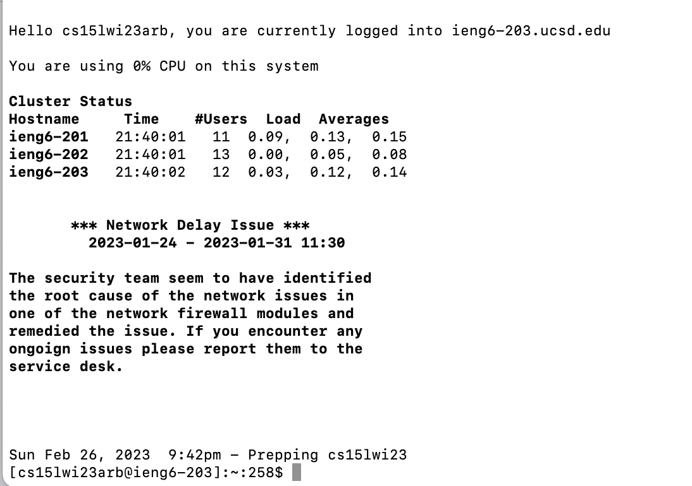
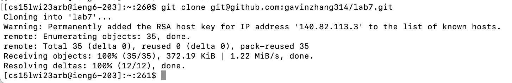
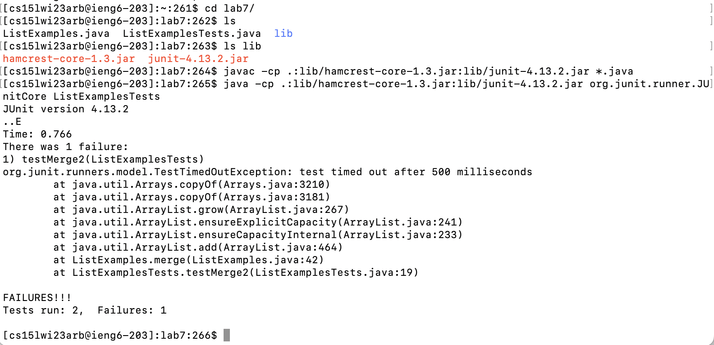
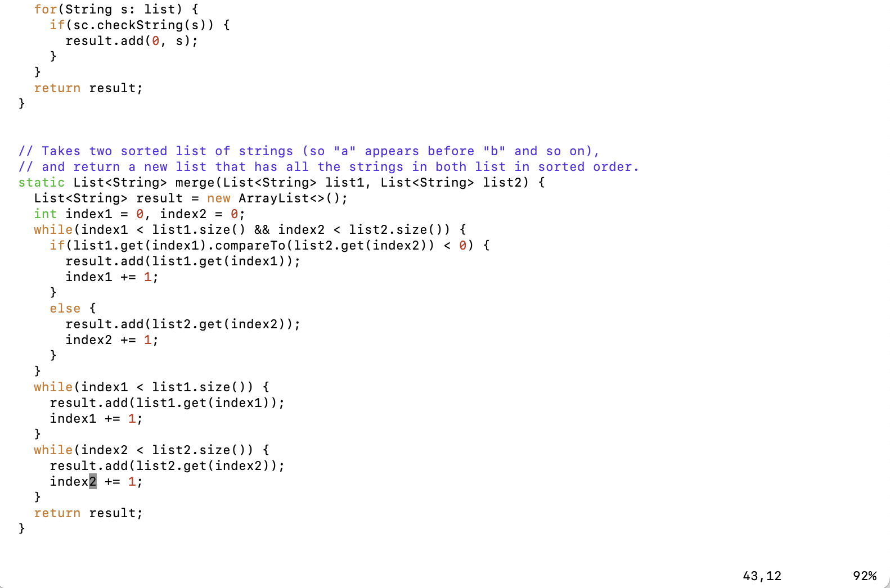
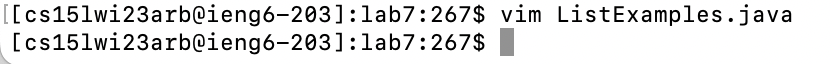
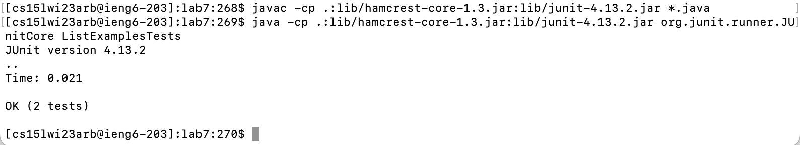
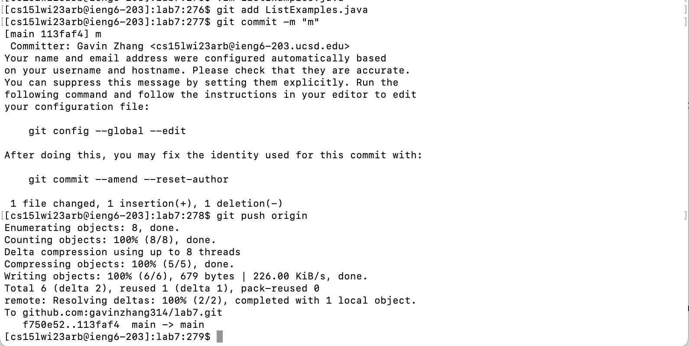

# Lab 4: CSE Labs Done Quick

## Step 4

Keys pressed:
`ssh cs15lwi23arb@ieng6.ucsd.edu<enter>`

This simply runs a command that `ssh`es into `ieng6.ucsd.edu`.

## Step 5

Keys pressed:
`git clone <cmd+v><enter>`

Before typing this command, I had copied the URL of my repository to my clipboard, so, instead of typing it out while cloning, I just had to paste it.

## Step 6

Keys pressed:
`cd l<tab><enter>`
`javac -cp .:lib/hamcrest-core-1.3.jar:lib/junit-4.13.2.jar *.java<enter>'
'<up><ctrl+a><right><right><right><right><right><delete><ctrl+e><ctrl+w>org.junit.runner.JUnitCore L<tab>T<tab><delete><enter>`

First, I navigated into the folder containing the repository, using tabs to autocomplete. Then, I manually typed out the command used to compile all of the `.java` files. Finally, to run the tests, I accessed the previous command, navigated to the front of the command to change `javac` to `java`, and the navigated to the back of the command to replace `*.java` with `junit.runner.JUnitCore ListExamplesTests`. I also used tab autocompletion to do this.

## Step 7

Keys pressed:
`vim L<tab>.<tab><enter>`
`43Ger2:wq<enter>`

Using tabs to autocomplete the filepath, I opened `ListExamples.java` in vim. Then, I navigated to the end of the first word in line 43, where the bug was, and replaced the `1` at the end of `input1` with a `2`. Finally, I saved my changes and then quit.

## Step 8

Keys pressed:
`<up><up><up><enter>`
`<up><up><up><enter>`

Since I had compiled and run the tests before, I simply used the arrow keys to retrive the commands I used to do so and rerun them.

## Step 9

Keys pressed:
`git add L<tab>.j<tab><enter>`
`git commit -m "m"<enter>`
`git push <tab><enter>`

With the exception of some tab autocomplete for the staging and pushing, I had to type out the commands to commit and push my changes in full.
