# Lab Report 5: Revisiting Lab Report 2 with `jdb`

I will be using `jdb` in order to figure out the values of the arguments passed to the methods that the server calls and to track the values of the class' fields.

This is the code I used for the server.


We want to know more about the arguments passed to the handler class' methods as well as the handler's fields.

According to the [documentation](https://docs.oracle.com/javase/7/docs/technotes/tools/windows/jdb.html) for the `jdb` command, in order to make it possible to access local variables, we have to compile our code with the `-g` command:

```
$ javac -g *.java
```

We start by running `jdb` with the following command to run the server on port 4000:

```
$ jdb StringServer 4000
```

This gives us a prompt:
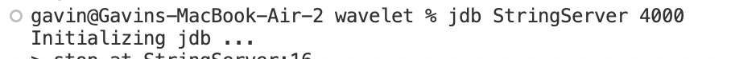

Since we want to monitor how everything changes each time the server is accessed, we should put a breakpoint right before `StringServerHandler.handleRequest()` exits when it's called. We can do this by placing breakpoints on the lines with `return` statements:

```
> stop at StringServerHandler:16
> stop at StringServerHandler:18
> stop at StringServerHandler:21
```

This gives us the following output:

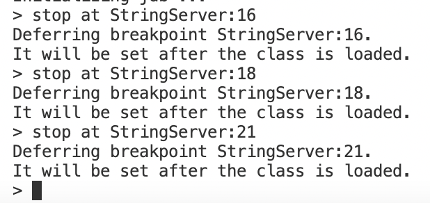

Then, we can run StringServer itself:

```
> run
```

This gives us the following output:

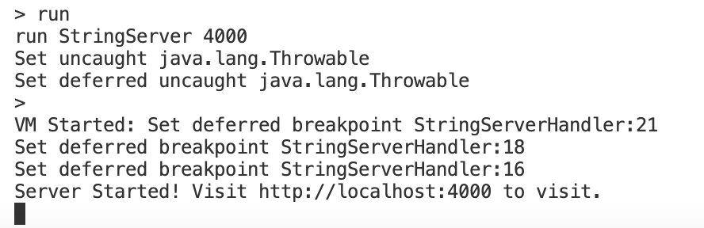

When we visit `http://localhost:4000/` in our browser, we trigger the breakpoint on line 21:

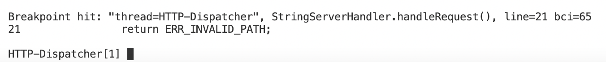

From the fact that this is the breakpoint on line 21, we know that this is the breakpoint that is supposed to be triggered when an invalid URL is passed to the function, right before it returns the error message associated with an invalid URL.

We can now use the `print` command to look at what the argument passed to `StringServerHandler.handleRequest()` is, as well as what the instance field `message` equals:

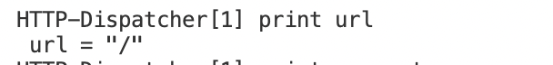
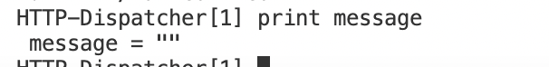

We can see that `message` doesn't seem to have been updated by visiting this path, as is expected.

Then, we can continue the program by running the `cont` command. At this point, our browser finally stops buffering and loads the website: 

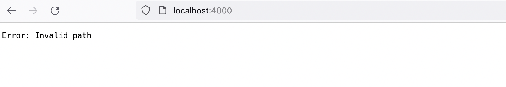

However, immediately afterwards, the same breakpoint is triggered again, even without entering another URL. Running `print url` tells us that this is just the browser requesting a favicon to put in the browser tab:

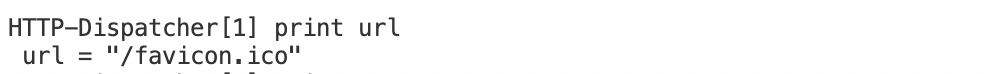

Now, let's try adding a message by visiting `http://localhost:4000/add-message?s=First%20message`. We hit a breakpoint, and since it's the breakpoint on line 16, we know that this breakpoint is supposed to run when we have successfully added a message:

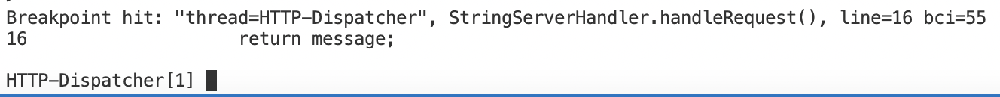

Once again, we can run `print url` and `print message` to see what argument is passed to `StringServerHandler.handleRequest()` and how that affects `message`:

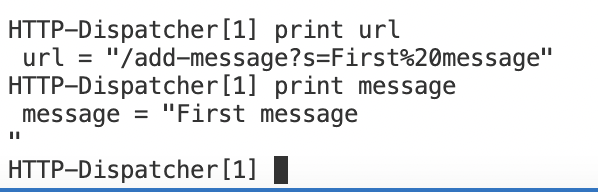

This tells us that `StringServerHandler.handleRequest()` has taken the URL that got passed to it and added its contents to `message`. 

Then, we can run `cont` to let `StringServerHandler.handleRequest()` finally finish running, at which point we see the contents of `message` load in the browser:

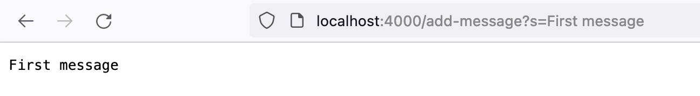

Unlike last time, we don't immediately hit another breakpoint from the server handling a request for a favicon. I'm guessing that this is because the browser caches favicons so it doesn't need to keep on sending requests for them.

If we visit `http://localhost:4000/add-message?s=Second%20message`, and then run the same commands, we can see that something similar is happening again. `StringServerHandler.handleRequest()` receives the URL we type into the browser, extracts the message from it, and then appends the message to `message`:

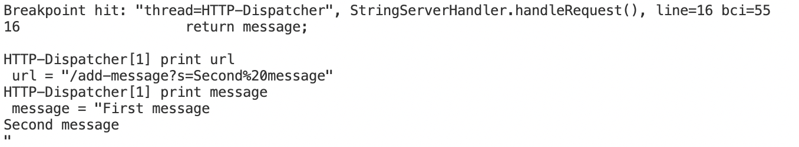

When we run `cont`, we see that the updated contents of `message` have been displayed in the browser:

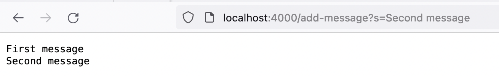

Finally, let's try an invalid parameter. If we visit `http://localhost:4000/add-message?invalid-parameter=Invalid%20parameter`, we stop at the breakpoint on line 18:

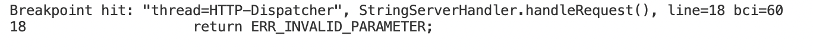

From the fact that this breakpoint stops the method right before it is supposed to return the error message for an invalid parameter, we know that this breakpoint is supposed to be triggered when our URL contains an invalid parameter.

We can then run `print url` and `print message` to see what is passed to the method and how that changes `message`:

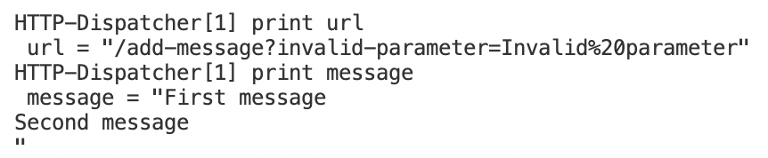

As expected, the method leaves `message` unchanged.

Finally, we can let the method finally resolve by running `cont`. We now see the error message that was returned on line 18 displayed in our browser:


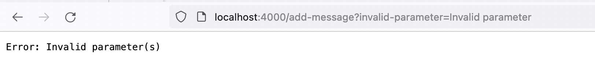
