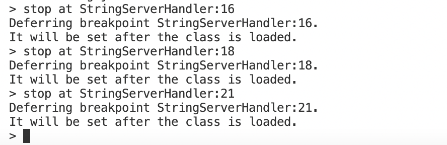

# Lab Report 5: Revisiting Lab Report 2 with JDB

## Part 1: `StringServer`

This is the code I used for the server.


We want to know more about the arguments passed to the handler class' methods as well as the handler's fields.

We start by running JDB with the following command to run the server on port 4000:

`$ jdb StringServer 4000`

This gives us our JDB prompt:


Since we want to monitor how everything changes each time the server is accessed, we should put a breakpoint right before `StringServerHandler.handleRequest()` exits when it's called. We can do this by placing breakpoints on the lines with `return` statements:

```
> stop at StringServerHandler:16
> stop at StringServerHandler:18
> stop at StringServerHandler:21
```

This gives us the following output:



Then, we can run StringServer itself:

```
> run
```

This gives us the following output:


When we visit `http://localhost:4000/`, we trigger the breakpoint on line 21:


We can now use the print command to look at what the argument passed to `StringServer.handleRequest()` is, as well as what the instance field `StringServerHandler.message` equals:

